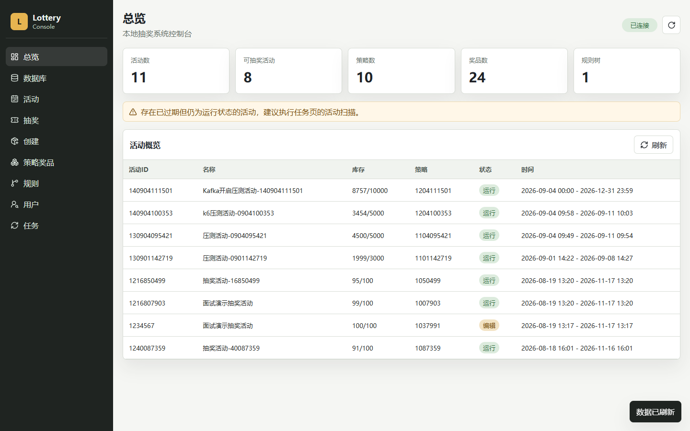
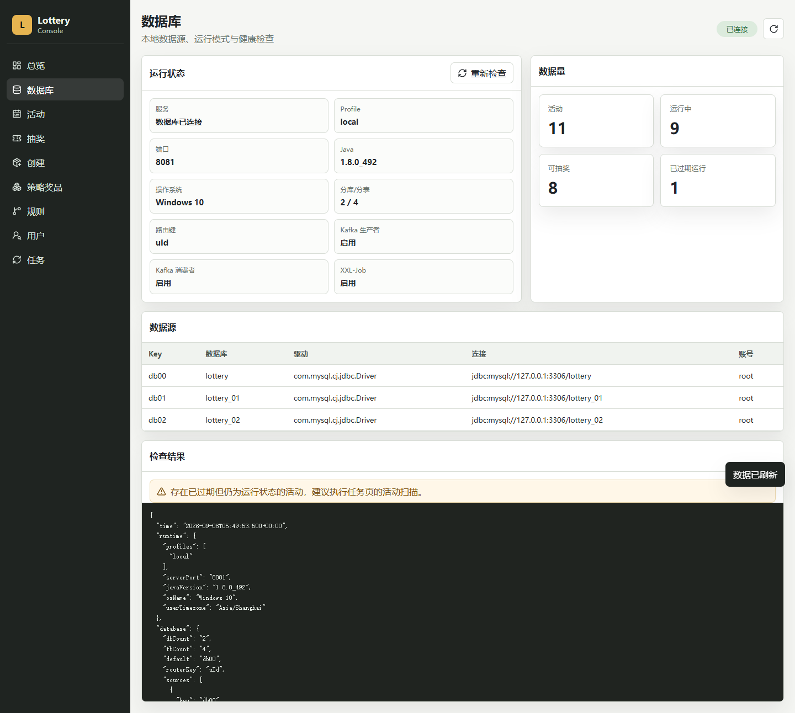
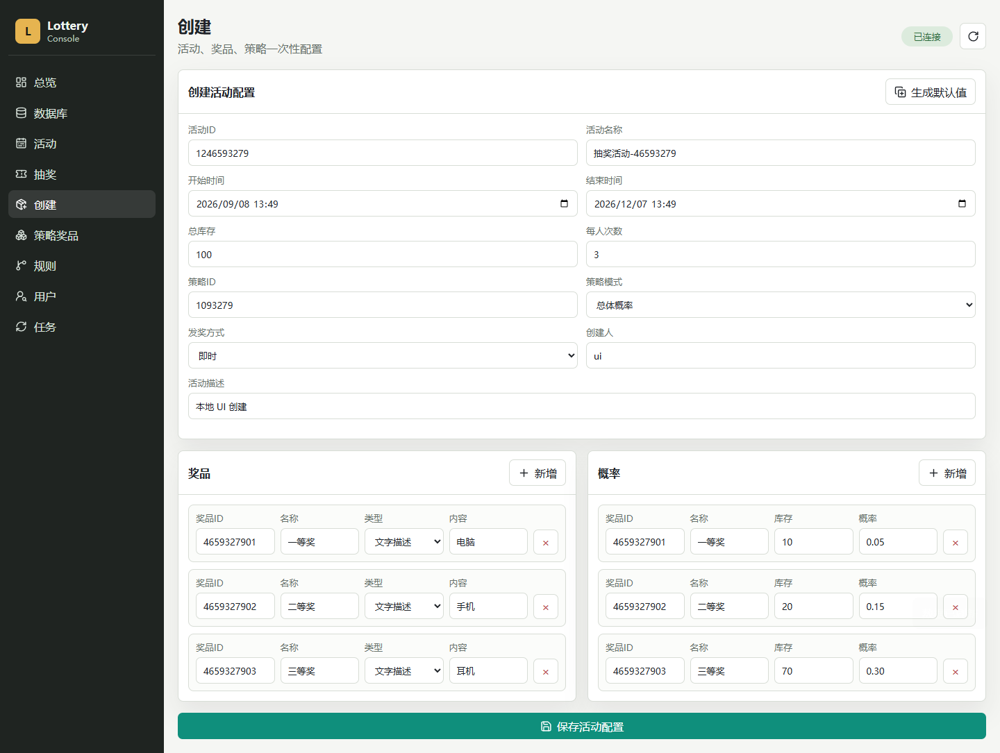
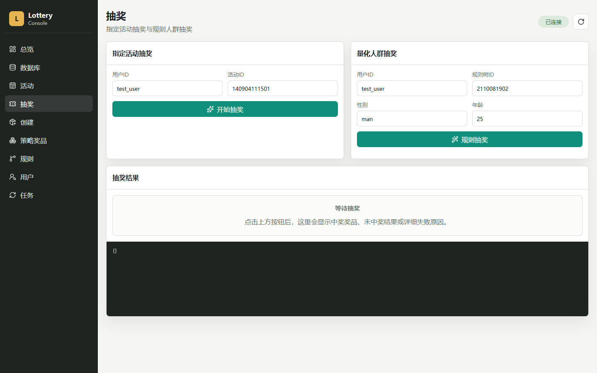
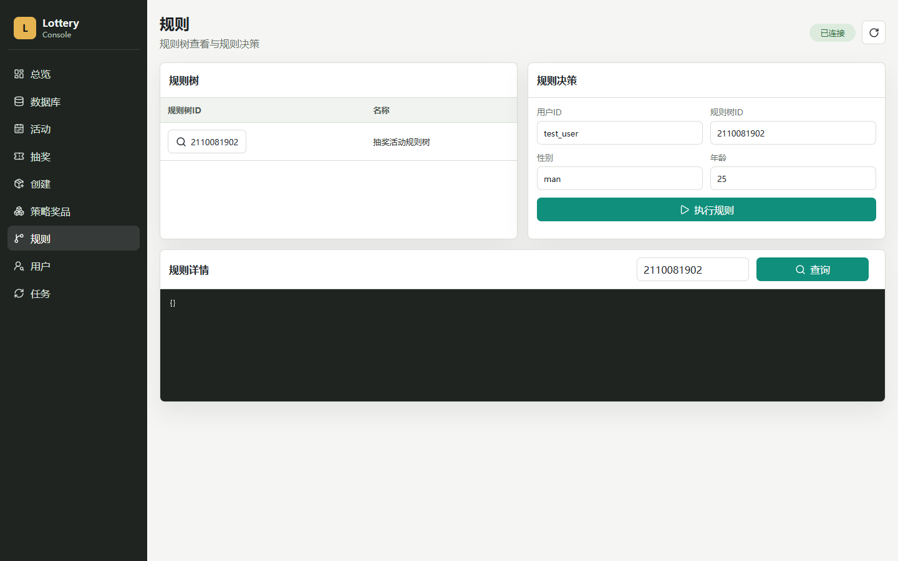
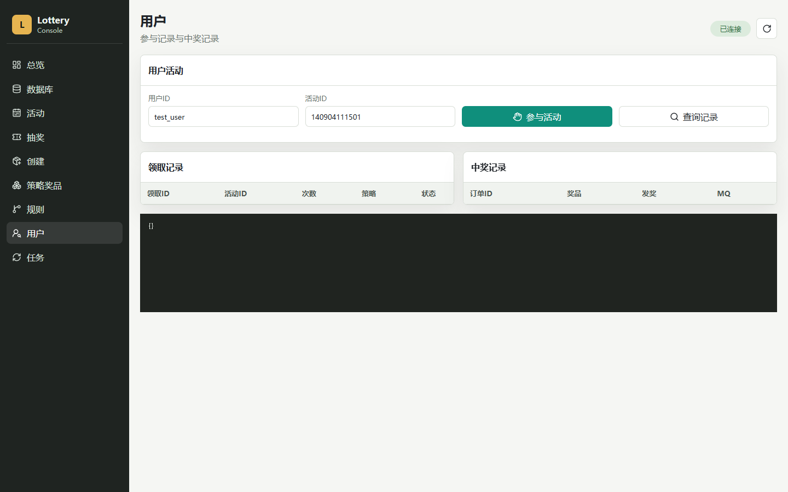
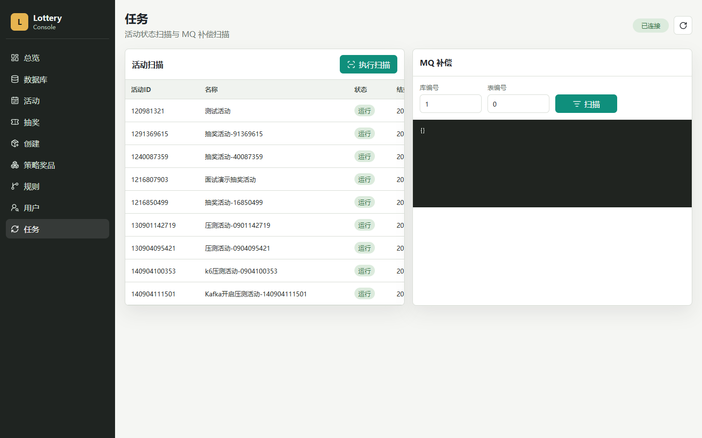

# Lottery 抽奖系统

一个面向营销活动场景的抽奖系统，覆盖“活动创建、策略配置、规则决策、用户参与、库存扣减、抽奖发奖、消息补偿、数据诊断、压测验证”等完整链路。项目基于 Spring Boot + DDD 分层实现，并补充了可视化控制台、Windows 本地一键启动脚本、Kafka/Nacos/XXL-Job 本地化运行能力，适合在面试中展示完整后端项目能力。



## 项目亮点

| 亮点 | 说明 |
|---|---|
| DDD 领域分层 | 按 application、domain、infrastructure、interfaces、rpc、common 分层，业务规则集中在领域层，接口层只负责适配和暴露能力 |
| 抽奖策略引擎 | 支持总体概率、单项概率两类抽奖算法，策略明细可配置奖品库存与中奖概率 |
| 规则树决策 | 支持基于用户性别、年龄等条件做人群量化，先决策可参与活动，再执行抽奖 |
| 分库分表 | 用户参与记录、领取次数、中奖发奖单走自研 db-router 路由组件，体现高并发数据拆分思路 |
| 状态机流转 | 活动状态支持编辑、提审、审核通过、拒绝、开启、关闭等动作，避免活动生命周期混乱 |
| MQ 异步削峰 | Kafka 用于参与记录、发奖单等消息处理，降低核心抽奖链路压力 |
| 定时补偿任务 | XXL-Job 用于扫描活动状态和 MQ 补偿任务，提升系统最终一致性 |
| 服务注册能力 | Nacos + Dubbo 可支持服务注册与 RPC 暴露，方便扩展为分布式部署 |
| 可视化后台 | 新增 Web 控制台，面试演示时可以直接创建活动、查看数据、执行抽奖和观察结果 |
| 本地工程化 | 提供数据库初始化、服务启动、中间件启动、冒烟测试、压测报告，降低演示环境搭建成本 |

## 技术栈

| 分类 | 技术 |
|---|---|
| 后端框架 | Spring Boot 2.6.0 |
| 持久层 | MyBatis、MySQL 8 |
| 架构模式 | DDD、领域服务、仓储接口、状态模式、策略模式、工厂模式 |
| RPC 与注册 | Dubbo 2.7.10、Nacos |
| 消息队列 | Kafka、ZooKeeper |
| 定时任务 | XXL-Job |
| 数据路由 | 自研 `db-router-spring-boot-starter` |
| 工具组件 | Fastjson、Hutool、MapStruct |
| 测试与压测 | JUnit、PowerShell 冒烟测试、k6 |
| 前端控制台 | 原生 HTML/CSS/JavaScript、REST API |

## 功能展示

### 1. 数据库与运行诊断

控制台可以查看 MySQL 连接状态、主库与分库配置、活动数量、策略数量、奖品数量、可抽奖活动数量，以及 Kafka、Nacos、XXL-Job 是否开启。



### 2. 创建活动、奖品和策略

创建页支持一次性配置活动、奖品、策略明细和中奖概率，适合面试时现场演示完整活动搭建流程。



### 3. 抽奖与中奖结果展示

抽奖页支持两种方式：

- 指定活动抽奖：输入用户 ID 和活动 ID，直接参与指定活动。
- 量化人群抽奖：输入用户画像和规则树 ID，先通过规则树决策，再进入符合条件的活动。

抽奖结果区会展示中奖奖品、奖品内容、奖品 ID、活动 ID；如果失败，会展示明确失败原因，避免只出现“未知错误”。



### 4. 规则树决策

规则页展示规则树和规则决策结果。当前系统内置年龄、性别等过滤节点，可以用于解释“为什么某个用户被分配到某个活动”。



### 5. 用户参与与中奖记录

用户页可以查询用户参与活动记录、剩余领取次数、中奖发奖单，并支持触发发奖操作。



### 6. 定时任务与补偿

任务页用于触发活动状态扫描和 MQ 补偿扫描。面试时可以用它说明系统如何处理异步消息失败、活动过期状态修正等问题。



## 核心业务流程

```text
创建活动
  -> 配置奖品
  -> 配置抽奖策略和概率
  -> 活动状态流转为运行
  -> 用户参与活动
  -> 扣减个人参与次数和活动库存
  -> 执行抽奖策略
  -> 生成中奖发奖单
  -> Kafka 异步处理参与记录和发奖消息
  -> XXL-Job 定时扫描补偿异常任务
```

规则人群抽奖流程：

```text
用户画像
  -> 规则树决策
  -> 命中活动 ID
  -> 活动参与校验
  -> 抽奖策略执行
  -> 返回中奖或未中奖结果
```

## 项目模块

| 模块 | 作用 |
|---|---|
| `lottery-interfaces` | 系统启动入口、REST API、Dubbo facade、Web 控制台静态资源 |
| `lottery-application` | 应用服务编排，负责抽奖流程、活动部署流程、MQ 生产消费、XXL-Job 任务 |
| `lottery-domain` | 领域核心，包含活动、策略、奖品、规则、状态机、ID 生成等业务规则 |
| `lottery-infrastructure` | MyBatis DAO、PO、Repository 实现、数据库访问和数据转换 |
| `lottery-rpc` | RPC 接口、请求对象、响应对象和 DTO 定义 |
| `lottery-common` | 通用返回对象、分页对象、常量 |
| `db-router-spring-boot-starter` | 自研分库分表路由组件，基于注解和 AOP 路由到不同数据库和表 |
| `scripts` | Windows 本地启动、停止、数据库初始化、冒烟测试、中间件启动脚本 |
| `doc` | SQL、部署文档、架构资料、README 截图资源 |

更完整的文件说明见：[PROJECT-FILES-GUIDE.md](PROJECT-FILES-GUIDE.md)

## 数据库设计

项目使用 1 个主库 + 2 个分库：

| 数据库 | 说明 | 典型表 |
|---|---|---|
| `lottery` | 主库，保存稳定业务配置 | `activity`、`award`、`strategy`、`strategy_detail`、`rule_tree`、`rule_tree_node`、`rule_tree_node_line` |
| `lottery_01` | 分库，保存用户参与和中奖数据 | `user_take_activity`、`user_take_activity_count`、`user_strategy_export` |
| `lottery_02` | 分库，保存用户参与和中奖数据 | `user_take_activity`、`user_take_activity_count`、`user_strategy_export` |

数据库脚本位置：

```text
doc/assets/sql/lottery.sql
doc/assets/sql/lottery_01.sql
doc/assets/sql/lottery_02.sql
doc/assets/sql/xxl-job.sql
```

## API 能力

| 接口 | 方法 | 作用 |
|---|---|---|
| `/api/lottery/health` | GET | 健康检查 |
| `/api/lottery/diagnostics` | GET | 数据库、中间件、运行数据诊断 |
| `/api/lottery/activities` | GET | 查询活动 |
| `/api/lottery/activities` | POST | 创建活动、奖品、策略 |
| `/api/lottery/activity/state` | POST | 活动状态流转 |
| `/api/lottery/partake` | POST | 用户参与活动 |
| `/api/lottery/draw` | POST | 指定活动抽奖 |
| `/api/lottery/quantification-draw` | POST | 量化人群抽奖 |
| `/api/lottery/rules/decision` | POST | 规则树决策 |
| `/api/lottery/strategies` | GET | 查询策略列表 |
| `/api/lottery/awards` | GET | 查询奖品列表 |
| `/api/lottery/users/{uId}/take-records` | GET | 查询用户参与记录 |
| `/api/lottery/users/{uId}/awards` | GET | 查询用户中奖记录 |
| `/api/lottery/jobs/activity-state-scan` | POST | 执行活动状态扫描 |
| `/api/lottery/mq/scan` | POST | 执行 MQ 补偿扫描 |
| `/api/lottery/distribution` | POST | 发奖处理 |

## 本地运行

### 1. 初始化数据库

确认 MySQL 已启动，默认账号为 `root / 123456`，然后执行：

```powershell
cd D:\java\Lottery
powershell -NoProfile -ExecutionPolicy Bypass -File .\scripts\init-db.ps1 -Reset -User root -Password 123456
```

### 2. 启动 Kafka、Nacos、XXL-Job

```powershell
cd D:\java\Lottery
powershell -NoProfile -ExecutionPolicy Bypass -File .\scripts\start-middleware.ps1
```

启动后可访问：

| 服务 | 地址 |
|---|---|
| Nacos | `http://localhost:8848/nacos` |
| Kafka | `127.0.0.1:9092` |
| ZooKeeper | `127.0.0.1:2181` |
| XXL-Job Admin | `http://localhost:7397/xxl-job-admin` |

### 3. 启动 Lottery 应用

```powershell
cd D:\java\Lottery
powershell -NoProfile -ExecutionPolicy Bypass -File .\scripts\start-local.ps1 -StopExisting
```

访问控制台：

```text
http://localhost:8081/
```

### 4. 冒烟测试

```powershell
cd D:\java\Lottery
powershell -NoProfile -ExecutionPolicy Bypass -File .\scripts\smoke-test.ps1
```

### 5. 停止服务

```powershell
cd D:\java\Lottery
powershell -NoProfile -ExecutionPolicy Bypass -File .\scripts\stop-local.ps1
powershell -NoProfile -ExecutionPolicy Bypass -File .\scripts\stop-middleware.ps1
```

## 演示路径

按下面顺序演示：

1. 打开总览页，说明系统当前有多少活动、策略、奖品和规则树。
2. 打开数据库页，说明主库保存活动配置，分库保存用户参与和中奖记录。
3. 打开创建页，现场创建一个活动，配置 3 个奖品和对应概率。
4. 打开活动页，把活动状态流转到运行状态。
5. 打开抽奖页，使用不同用户 ID 执行指定活动抽奖，展示中奖奖品或失败原因。
6. 打开规则页，输入用户画像，展示规则树如何做人群决策。
7. 打开用户页，查询用户参与记录和中奖发奖单。
8. 打开任务页，说明 XXL-Job 如何做活动状态扫描和 MQ 补偿。
9. 打开压测报告，说明当前瓶颈和后续优化方向。

## 压测结果

已使用 k6 对核心抽奖接口做过 500、1000、2000 并发压测，完整报告见：[PRESSURE-TEST-REPORT-MIDDLEWARE.md](PRESSURE-TEST-REPORT-MIDDLEWARE.md)

| 并发 | 请求数 | 业务成功率 | 失败率 | 平均响应 | P95 |
|---:|---:|---:|---:|---:|---:|
| 500 | 500 | 32.00% | 68.00% | 1.86s | 7.96s |
| 1000 | 1000 | 34.50% | 65.50% | 6.04s | 24.11s |
| 2000 | 2000 | 17.25% | 82.75% | 8.75s | 29.96s |

压测结论：

- Kafka、Nacos、XXL-Job 已经在本地完整模式下开启。
- 当前单机 Windows 环境不代表企业生产环境，500 并发以上已经出现连接拒绝和请求超时。
- 系统具备高并发架构雏形，但还需要继续做限流、Redis 库存预扣、接口异步化、Tomcat 线程池调优、数据库连接池调优和多实例部署。

## 后续优化方向

| 方向 | 价值 |
|---|---|
| 接入 Redis 原子库存扣减 | 减少数据库热点写入，提高抽奖入口吞吐量 |
| 增加 Sentinel 或 Redis 令牌桶限流 | 防止瞬时流量直接打穿 Tomcat 和数据库 |
| 抽奖链路进一步异步化 | 将非核心写入和发奖动作下沉到 MQ |
| 增加接口鉴权和后台登录 | 避免管理接口裸露 |
| 增加 Testcontainers 或 Docker Compose | 让 MySQL、Kafka、Nacos、XXL-Job 环境更容易复现 |
| 增加 Prometheus + Grafana | 展示 QPS、P95、错误率、线程池和数据库连接池指标 |

## 
